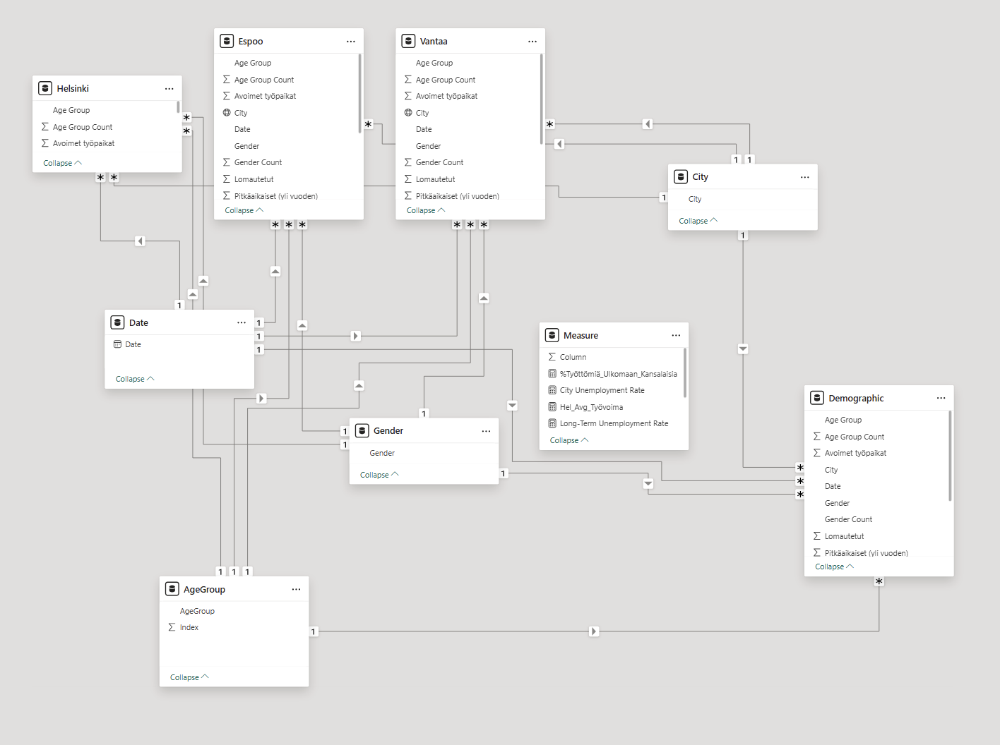

# Finnish Labor Market Trends: Helsinki, Espoo, Vantaa (2015-2024)

## Project Overview

This project analyzes monthly labor market data for three major Finnish cities: Helsinki, Espoo, and Vantaa, spanning from 2015 to 2024. The goal is to visualize key trends, demographic breakdowns of the unemployed population, and provide forecasts for selected indicators. The data, sourced from Finland's public data portal, was processed and then analyzed using Power BI to create an interactive dashboard.

## Data Source

* **Primary Source:** Public labor market datasets from [avoindata.fi](https://avoindata.fi/).
* **Data Processing:** Raw data was initially processed using Microsoft Excel. This involved cleaning, structuring, and unpivoting relevant columns (e.g., for gender and age groups) to create three distinct datasets for Helsinki, Espoo, and Vantaa.
* **Data Format:** Processed data was imported into Power BI.

## Tech Stack & Workflow

* **Tools:** Microsoft Excel (for data preprocessing), Microsoft Power BI (for data modeling, analysis, and visualization), DAX (for calculations).
* **Workflow Summary:** Data Downloaded ([avoindata.fi](https://avoindata.fi/)) -> Preprocessed & Unpivoted (Excel) -> Imported into Power BI -> Data Modeled (9 tables: `Helsinki`, `Espoo`, `Vantaa`, `Date`, `Measures`, `City`, `Demographic`, `Gender`, `Age Group`) -> Validated, Analyzed & Visualized (Power BI with DAX).

## Validation, Analysis & Code

Data validation and analysis were performed within Power BI using DAX measures and visual inspection. Key steps included:

* **Validation:**
    * Correcting DAX measures (e.g., using `SUMMARIZE` and `AVERAGEX`, or simplified `AVERAGE`) to accurately calculate metrics like average `Työvoima` from the unpivoted 'Demographic' table.
    * Addressing forecast anomalies (e.g., adjusting the y-axis start for `Lomautetut`, applying seasonality settings for `Avoimet työpaikat`).
    * Ensuring logical calculations for ratios and percentages.
* **Analysis:** The Power BI report is structured into three main pages:
    * **Overview:** Provides a high-level summary of key indicators like average unemployed, average labor force, job vacancies, and overall unemployment rate changes[cite: 1].
    * **Demographic:** Explores the composition of the unemployed population by gender, age group, long-term status, and foreign citizenship[cite: 3].
    * **Trends & Forecast:** Visualizes historical trends (2015-2024) for unemployment, job seekers, vacancies, and layoffs. Includes forecasts for layoffs and vacancies, and explores the relationship between vacancies and unemployment using a scatter plot with a time-based play axis[cite: 4].
* **Code:** DAX was used extensively within Power BI to create calculated measures for all necessary aggregations, time intelligence calculations (e.g., forecasts, averages), and specific analysis metrics.

## Key Findings

* The interactive dashboard visualizes monthly labor market trends from 2015-2024 across Helsinki, Espoo, and Vantaa
* Significant differences in the scale of labor force, unemployment, and job vacancies are observable between the three cities
* Demographic analysis reveals the distribution of unemployment across different age groups and genders, as well as trends in long-term unemployment and unemployment among foreign citizens
* Trend analysis highlights historical patterns, including a noticeable spike in layoffs (`Lomautetut`) around 2020
* Forecasts suggest future directions for layoffs and job vacancies, incorporating factors like seasonality where applicable
* The relationship between job vacancies and the number of unemployed/job seekers shows dynamic changes over time, visualized through the scatter plot

## Future Work / Limitations

* Forecasts are based on historical trends and Power BI's built-in algorithms (or simple DAX methods); they cannot predict unforeseen economic events and have inherent uncertainty.
* Further analysis could explore correlations with other economic indicators or break down data by industry sector if available.
* Error handling and data validation could be further enhanced.
